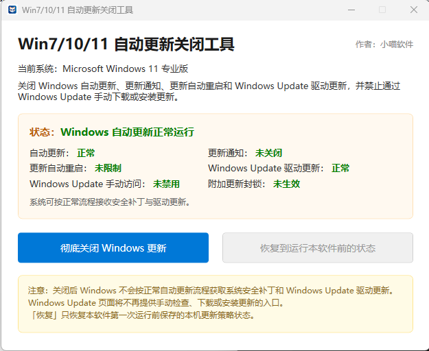
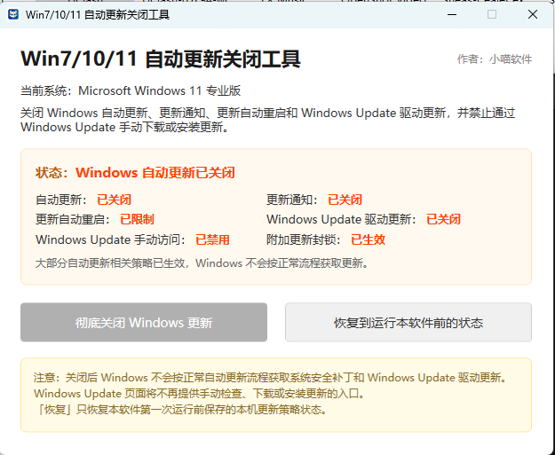

# 小喵 Windows 更新助手（XiaoMiaoWinUpdate）

<p align="center">
  
</p>

一键关闭 / 恢复 Windows 自动更新的单文件桌面工具。兼容 Windows 7 / 8.1 / 10 / 11，首次运行自动备份本机原有更新策略，恢复时回写注册表、服务与计划任务。

---

## ⚠️ Windows 7 / 8.1 用户必读（运行环境要求）

本程序基于 **.NET Framework 4.8** 开发。不同系统的运行时情况如下：

- **Windows 10 / 11**：系统通常已自带或已安装 .NET Framework 4.8，一般可直接运行。
- **Windows 7 / 8.1**：全新安装的系统**往往没有** .NET Framework 4.8 运行库。若直接双击 `XiaoMiaoWinUpdate.exe`，会弹出「需要 .NET Framework v4.0.30319」的报错。

> **关于报错里那个 v4.0.30319**：它只是 .NET 4.x 系列 CLR 的版本号，并不是「缺 4.0」。报错的本质是**系统缺少 .NET Framework 4.8 运行时**。因此解决办法是安装 4.8，而不是 4.0。

### 两种解决方式

1. **手动安装官方离线包（推荐无网络环境）**
   从微软官方下载页获取离线安装包并按提示安装：
   - 下载页：<https://dotnet.microsoft.com/download/dotnet-framework/net48>
   - 离线包文件名：`ndp48-x86-x64-allos-enu.exe`
   安装完成后即可直接双击 `XiaoMiaoWinUpdate.exe` 使用。

2. **使用本仓库的安装包（自动检测并安装）**
   直接下载并用管理员身份运行本仓库生成的 `XiaoMiaoWinUpdate_Setup.exe`：
   > **Windows 7 / 8.1 离线用户**：建议改用 `XiaoMiaoWinUpdate_Setup_Win7.exe`（已内置 .NET 4.8 离线包，双击全自动安装，无需联网或准备文件，详见第 9 节）。
   - 安装包会自动检测系统中是否已安装 .NET Framework 4.8；
   - 若未安装，会**自动静默安装** 4.8 运行库（需同目录附带 `ndp48-x86-x64-allos-enu.exe`），或引导你打开官方下载页手动安装；
   - 随后释放主程序，并在桌面 / 开始菜单创建快捷方式。

> **安装包用法**：下载 `XiaoMiaoWinUpdate_Setup.exe` 后双击，按提示「下一步」即可完成安装（安装过程会请求管理员权限，请允许）。离线包准备与编译说明详见仓库根目录 `setup.nsi` 顶部注释。

---

## 1. 界面预览

<p align="center">
  
  <br>
  <sub>图 1：系统更新正常运行状态</sub>
</p>

<p align="center">
  
  <br>
  <sub>图 2：Windows 自动更新已彻底关闭</sub>
</p>

---

## 2. 工程结构

| 文件 | 说明 |
|------|------|
| `XiaoMiaoWinUpdate.sln` | Visual Studio 解决方案 |
| `XiaoMiaoWinUpdate.csproj` | Old-style C# 工程文件，目标 .NET Framework 4.8 |
| `app.manifest` | 管理员提权（`requireAdministrator`）+ OS 兼容性清单 |
| `FodyWeavers.xml` | Costura.Fody 配置，打包为单 exe |
| `App.xaml` / `App.xaml.cs` | WPF 入口，启动时校验管理员权限 |
| `MainWindow.xaml` / `MainWindow.xaml.cs` | 主窗口与按钮事件 |
| `Models/UpdateStatus.cs` | 6 项状态模型 + 系统信息（INPC 绑定） |
| `Services/PolicyEngine.cs` | 注册表 / 服务 / 计划任务读写与状态计算 |
| `Services/BackupService.cs` | 首次备份、JSON 序列化、恢复逻辑 |
| `Services/OsHelper.cs` | Windows 版本检测 |
| `Services/AdminHelper.cs` | 当前进程管理员身份检测 |
| `Properties/AssemblyInfo.cs` | 程序集信息 |
| `Properties/Settings.settings` / `Settings.Designer.cs` | Old-style 工程默认设置文件 |
| `README.md` | 本文档 |

---

## 3. 本地编译步骤

### 3.1 环境要求

- Windows 10/11 开发机（推荐）
- Visual Studio 2022
- .NET Framework 4.8 目标包（安装 VS 时勾选「.NET Framework 4.8 目标包」）
- 可选：Visual Studio 的「.NET 桌面开发」工作负荷

> **注意**：本程序目标框架为 .NET Framework 4.8，**Release 编译产物 `bin\Release\XiaoMiaoWinUpdate.exe` 依赖系统中已安装 .NET Framework 4.8 运行时**。Windows 10 / 11 通常已自带；Windows 7 / 8.1 需先安装 4.8（见顶部「⚠️ Windows 7 / 8.1 用户必读」），或改用仓库的 `setup.nsi` 安装包自动安装（见第 9 节）。

### 3.2 用 Visual Studio 编译

1. 打开 `XiaoMiaoWinUpdate.sln`。
2. 顶部工具栏选择 `Release` + `Any CPU`。
3. 菜单栏 `生成` → `生成解决方案`（快捷键 `Ctrl+Shift+B`）。
4. Costura.Fody 会在编译后将 `Newtonsoft.Json.dll` 等依赖嵌入 exe。

### 3.3 用 MSBuild 命令行编译

在「Developer Command Prompt for VS 2022」中执行：

```cmd
cd /d E:\.workbuddy\2026-08-17-20-07-51\winupdate-disabler
msbuild XiaoMiaoWinUpdate.sln /p:Configuration=Release /p:Platform="Any CPU" /restore
```

> `/restore` 会先还原 NuGet 包（Costura.Fody、Newtonsoft.Json）。

### 3.4 编译产物位置

```
bin\Release\XiaoMiaoWinUpdate.exe
```

该目录下应只保留一个 `XiaoMiaoWinUpdate.exe`（以及可选的 `.pdb`）。所有依赖已通过 Costura.Fody 嵌入 exe 内部，不再需要 Newtonsoft.Json.dll。

---

## 4. EV 代码签名步骤

签名可显著降低 Windows Defender / 第三方杀毒软件的误报率。证书需自行向 DigiCert、Sectigo、GlobalSign 等 CA 申请 EV 代码签名证书。

### 4.1 使用 signtool 签名（普通 EV 令牌 / HSM）

在「Developer Command Prompt for VS 2022」中执行：

```cmd
cd /d E:\.workbuddy\2026-08-17-20-07-51\winupdate-disabler\bin\Release

signtool sign /tr http://timestamp.digicert.com /td sha256 /fd sha256 /a XiaoMiaoWinUpdate.exe
```

参数说明：

- `/tr`：RFC 3161 时间戳服务器（DigiCert）。
- `/td sha256`：时间戳摘要算法。
- `/fd sha256`：文件摘要算法。
- `/a`：自动选择本机可用的代码签名证书。

### 4.2 使用 SHA1 + SHA256 双签名（兼容旧版 Windows）

```cmd
signtool sign /v /fd sha1 /t http://timestamp.digicert.com /a XiaoMiaoWinUpdate.exe
signtool sign /v /fd sha256 /tr http://timestamp.digicert.com /td sha256 /a /as XiaoMiaoWinUpdate.exe
```

> 第二行的 `/as` 表示追加签名，保留第一行的 SHA1 签名。

### 4.3 验证签名

```cmd
signtool verify /pa XiaoMiaoWinUpdate.exe
```

---

## 5. Microsoft Defender 误报白名单提交

即使拥有 EV 签名，新发布的 exe 仍可能被 Microsoft Defender 或某些安全软件临时标记。建议主动向微软提交：

1. 打开 [Microsoft Defender 文件提交页面](https://www.microsoft.com/en-us/wdsi/filesubmission)。
2. 登录微软账号。
3. 选择 `Software developer`（软件开发者）。
4. 上传 `XiaoMiaoWinUpdate.exe`。
5. 填写信息：
   - **Company name**：小喵软件 / XiaoMiao Software
   - **Product name**：小喵 Windows 更新助手
   - **Description**：A system utility to disable/restore Windows Update policies with user consent and admin elevation.
   - **Detection name**：如果已被 Defender 拦截，填写对应的威胁名称（如 `Trojan:Win32/Wacatac.B!ml`）。
6. 提交后通常 24 小时内会收到审核结果邮件。

---

## 6. 备份与恢复机制

- 首次点击「彻底关闭 Windows 更新」时，程序会先在 `%LOCALAPPDATA%\XiaoMiaoWinUpdate\backup.json` 创建全量备份。
- 备份内容：
  - 相关 HKLM 注册表键的所有当前值（含值类型）
  - `wuauserv`、`UsoSvc`、`WaaSMedicSvc` 服务的启动类型与状态
  - Win10/11 下相关计划任务的启用状态
- 点击「恢复到运行本软件前的状态」时，从 `backup.json` 回写所有记录，恢复首次运行前的策略。
- 如果 `backup.json` 不存在，程序会提示用户先执行关闭操作，不会崩溃。

---

## 7. 注意事项

- 本工具需要管理员权限，会通过 `app.manifest` 自动触发 UAC 提权。
- 修改注册表、服务与计划任务属于系统级操作，请在使用前确认已备份重要数据。
- 程序已对每个写操作做 `try/catch` 处理，失败时会弹出中文错误提示并刷新状态。
- **关于 Windows Update Medic（WaaSMedicSvc，仅 Win10/11）**：该服务是 Windows 的「自愈」组件，可能会重新启用被禁用的 Windows 更新服务。本工具会尝试禁用它，但若系统自愈机制在未来重新拉起更新服务，属于 Windows 预期行为，并非本工具失效。如遇此情况，可重新运行本工具点击「彻底关闭 Windows 更新」。
- **CI / 分发签名（F9）**：单文件 `XiaoMiaoWinUpdate.exe` 在分发前务必按第 4 节用 EV 证书签名，否则新版 exe 极易被 Microsoft Defender / 第三方杀毒软件误报。建议在 CI 流水线中将 signtool 步骤加入自动发布流程。

---

## 8. 免责声明 / Disclaimer

- 本工具仅供**个人用户在自己拥有合法授权的设备上**、出于知情与自愿的前提下管理系统更新策略使用。
- 关闭 Windows 自动更新可能使系统错过安全补丁，增加安全风险。**请自行评估风险，并定期手动检查重要安全更新。**
- 作者不对因使用、误用本工具导致的任何系统不稳定、数据丢失或安全问题承担责任；使用即表示你已阅读并理解上述风险。
- 本软件按「现状」提供（详见 `LICENSE`），不提供任何明示或暗示的担保。
- This software is provided "as is", without warranty of any kind. Use at your own risk.

---

## 9. 安装包构建（setup.nsi）

仓库根目录的 `setup.nsi` 是一个 NSIS 安装脚本，通过编译开关 `!ifdef INCLUDE_DOTNET` 生成**两个**安装包：标准版（不含离线包）与 Win7 专用版（内置 .NET 4.8 离线包，完全离线一键装）。两个包均会自动检测系统中是否已安装 .NET Framework 4.8，缺失时静默安装后再释放主程序（详见脚本顶部注释）。

### 9.1 两个安装包的区别

| 安装包 | 编译命令 | 适用场景 | .NET 4.8 缺失时的行为 |
|--------|----------|----------|------------------------|
| `XiaoMiaoWinUpdate_Setup.exe`（标准版） | `makensis setup.nsi` | Windows 10 / 11，或已/将自行安装 .NET 4.8 的环境 | 优先用安装包**同目录**的外置 `ndp48-x86-x64-allos-enu.exe` 静默安装；无外置包则打开官方下载页并提示手动安装后重试 |
| `XiaoMiaoWinUpdate_Setup_Win7.exe`（Win7 专用版） | `makensis /DINCLUDE_DOTNET setup.nsi` | Windows 7 / 8.1 等往往没有 4.8 的离线环境 | 自动把**打包在安装包内部**的 `ndp48` 离线包释放到临时目录并静默安装（`/q /norestart`），无需联网或准备文件 |

> **如何选择**：Win10 / 11 用户下载标准版即可；Win7 / 8.1 用户（尤其无网或不想手动找离线包）直接下载「Win7 专用版」，双击即可全自动装好 4.8 + 主程序。

### 9.2 构建步骤

1. 安装 NSIS 3.x（<https://nsis.sourceforge.io/>）。
2. 确保仓库根目录存在：
   - `bin\Release\XiaoMiaoWinUpdate.exe`（Release 编译产物）
   - `icon.ico`
   - 生成「Win7 专用版」时还需 `ndp48-x86-x64-allos-enu.exe`（标准版不强制要求，运行时再外置即可）
3. 在项目根目录按需要执行：

   ```cmd
   :: 标准版（不含离线包）
   makensis setup.nsi

   :: Win7 专用版（内置 .NET 4.8 离线包）
   makensis /DINCLUDE_DOTNET setup.nsi
   ```

4. 生成的两个安装包分别为 `XiaoMiaoWinUpdate_Setup.exe` 与 `XiaoMiaoWinUpdate_Setup_Win7.exe`。

### 9.3 说明

- 两个安装包都请求**管理员权限**（`RequestExecutionLevel admin`），因为主程序需修改系统服务 / 注册表。
- 若 .NET 4.8 安装失败（被取消或返回非零），安装程序会提示并中止，绝不带病进入主安装流程。
- 安装后提供卸载程序（`Uninstall.exe`），会从桌面 / 开始菜单与安装目录清理本程序。
